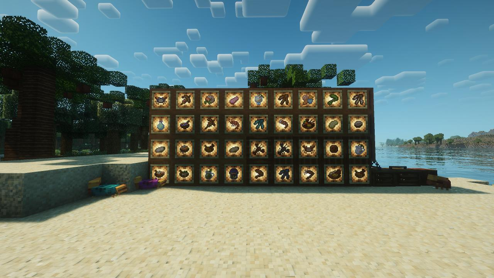
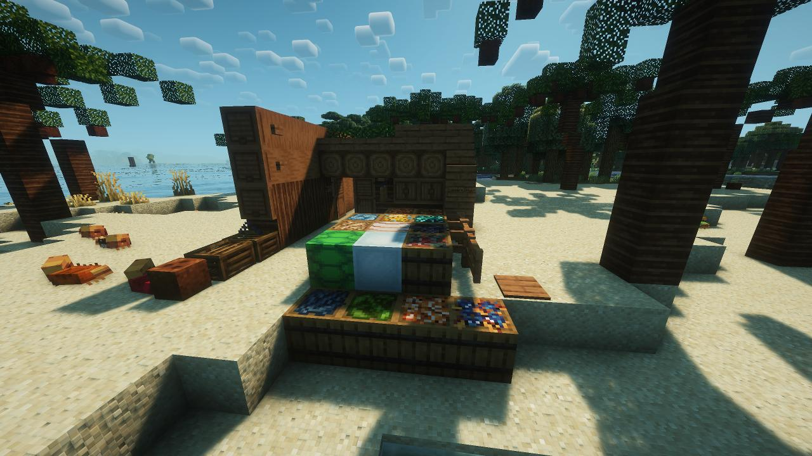
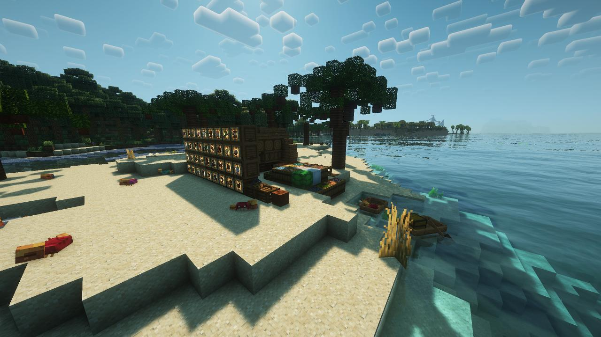

# Crabber's Delight（Fabric 移植版）

> 非官方 Fabric 移植。原模组 **Crabber's Delight** 由 [AlabasterLeking](https://github.com/AlabasterLeking/Crabbers-Delight) 开发，
> 本仓库在保留原版玩法与数值的基础上移植到 **Fabric 1.20.1**。


## 致谢

特别感谢原作者 [AlabasterLeking](https://github.com/AlabasterLeking/Crabbers-Delight) 创作了 Crabber's Delight
（含全部代码、纹理与模型资产），本 Fabric 移植版建立在原作者的工作之上。

## 游戏截图








## 依赖

| 模组 | 类型 | 说明 |
| --- | --- | --- |
| [Farmer's Delight Refabricated](https://modrinth.com/mod/farmers-delight-refabricated) | 必需 | 原模组前置 |
| [Forge Config API Port](https://modrinth.com/mod/forge-config-api-port) | 必需 | 提供配置 API |

## 已实现功能

- 螃蟹：自然生成、变体、可装桶，蟹钳工具
- 捕蟹笼：鱼饵/鱼饵桶、战利品表
- 棕榈树：原木/木板/楼梯/台阶/栅栏/门/活板门/告示牌/船等
- 椰子头盔、珍珠项链
- 全部食材与食谱
- 贝壳
- 独立创造模式标签页

## 与原版（Forge）的差异
- 穿戴效果刷新策略：每秒刷新、每次 16 秒，降低每 tick 调用的性能消耗

## 构建

需要 **Java 21+**：

```bash
./gradlew build
```

产物位于 `build/libs/`。

## 许可证

[MIT](LICENSE)。原代码版权归 AlabasterLeking（2023）；Fabric 移植部分版权归 CloseDW（2026）。
